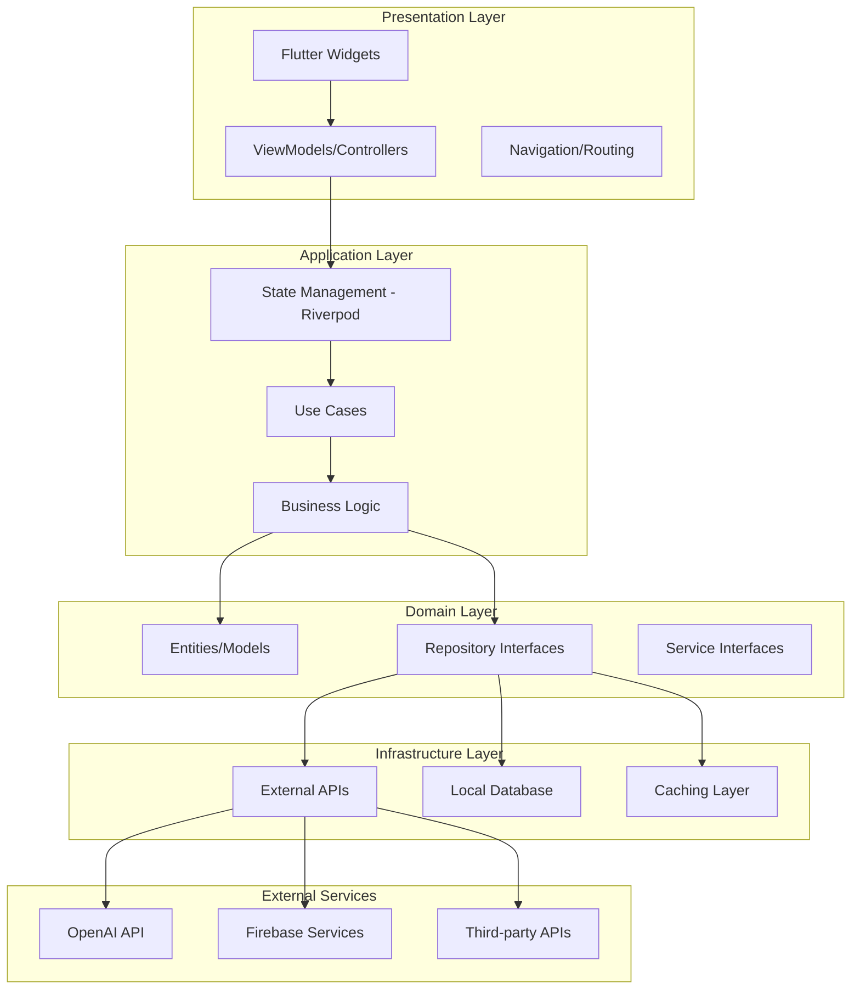
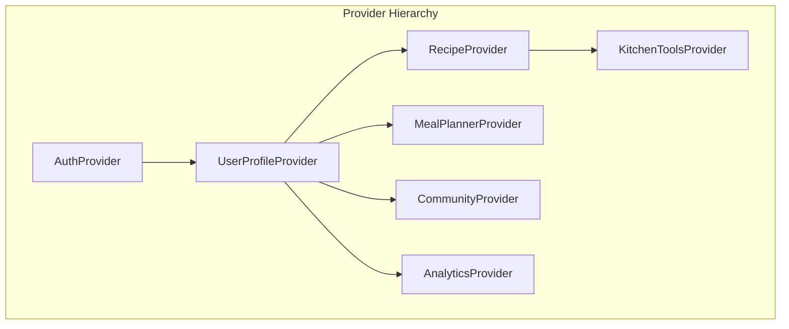
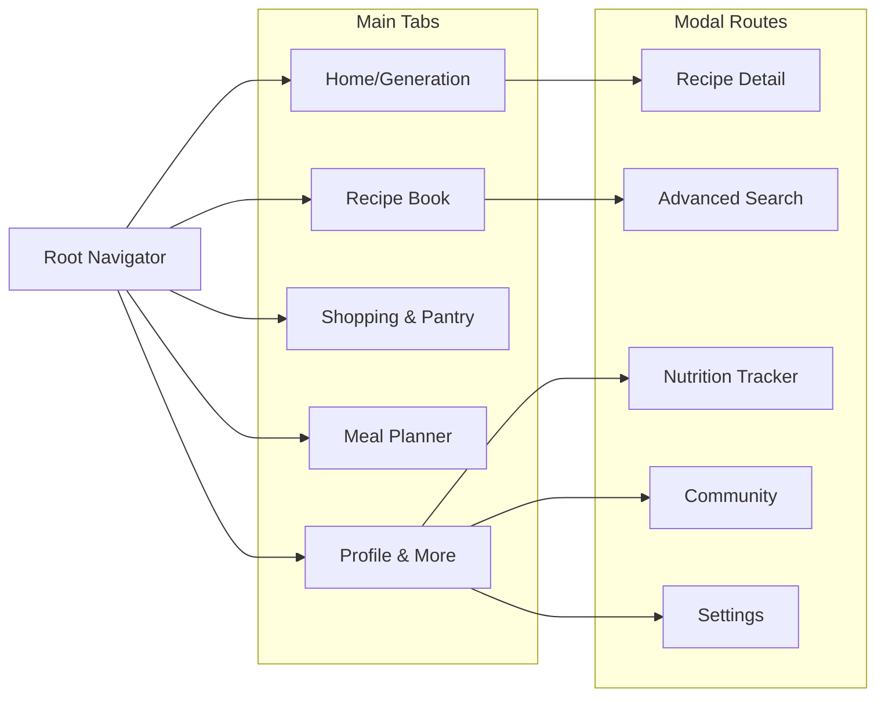

# Design Document

## Overview

ChefMind AI is architected as a modern Flutter application following Clean Architecture principles with MVVM pattern implementation. The system integrates multiple external services including OpenAI for recipe generation, Firebase for backend services, and various third-party APIs for enhanced functionality. The application is designed to be scalable, maintainable, and performant across mobile and tablet devices.

The core architecture separates concerns into distinct layers: Presentation (UI/Widgets), Application (Business Logic/State Management), Domain (Entities/Use Cases), and Infrastructure (External Services/Data Sources). This separation ensures testability, maintainability, and flexibility for future enhancements.

## Architecture

### High-Level Architecture



### State Management Architecture

The application uses Riverpod for state management with a hierarchical provider structure:



### Navigation Structure

The app implements a bottom navigation structure with deep linking support:



## Components and Interfaces

### Core Components

#### 1. Recipe Generation Engine

**Purpose:** Handles AI-powered recipe generation using OpenAI API

**Key Classes:**
- `RecipeGenerationService`: Manages OpenAI API interactions
- `IngredientParser`: Validates and processes ingredient inputs
- `RecipeCache`: Handles local caching of generated recipes
- `VoiceInputHandler`: Manages speech-to-text functionality

**Interfaces:**
```dart
abstract class IRecipeGenerationService {
  Future<Recipe> generateRecipe(List<String> ingredients, UserPreferences preferences);
  Future<Recipe> modifyRecipe(Recipe recipe, ModificationRequest request);
  Future<List<Recipe>> generateMealPlan(MealPlanRequest request);
}

abstract class IIngredientParser {
  List<Ingredient> parseIngredients(String input);
  bool validateIngredients(List<Ingredient> ingredients);
  List<String> getSuggestions(String partial);
}
```

#### 2. User Management System

**Purpose:** Handles authentication, profile management, and user preferences

**Key Classes:**
- `AuthenticationService`: Firebase Auth integration
- `UserProfileRepository`: User data management
- `PreferencesManager`: Dietary restrictions and preferences
- `SyncService`: Cross-device data synchronization

**Interfaces:**
```dart
abstract class IAuthenticationService {
  Future<User?> signInWithGoogle();
  Future<User?> signInWithEmail(String email, String password);
  Future<void> signOut();
  Stream<User?> get authStateChanges;
}

abstract class IUserProfileRepository {
  Future<UserProfile> getUserProfile(String userId);
  Future<void> updateUserProfile(UserProfile profile);
  Future<void> deleteUserProfile(String userId);
}
```

#### 3. Recipe Management System

**Purpose:** Handles recipe storage, organization, and retrieval

**Key Classes:**
- `RecipeRepository`: Recipe CRUD operations
- `CollectionManager`: Recipe organization and folders
- `SearchEngine`: Advanced recipe search functionality
- `RatingSystem`: Recipe rating and review management

**Interfaces:**
```dart
abstract class IRecipeRepository {
  Future<void> saveRecipe(Recipe recipe);
  Future<Recipe?> getRecipe(String recipeId);
  Future<List<Recipe>> getUserRecipes(String userId);
  Future<void> deleteRecipe(String recipeId);
}

abstract class ISearchEngine {
  Future<List<Recipe>> searchRecipes(SearchQuery query);
  Future<List<Recipe>> searchByImage(File image);
  Future<List<Recipe>> searchByVoice(String voiceQuery);
}
```

#### 4. Shopping and Pantry System

**Purpose:** Manages pantry inventory and shopping list generation

**Key Classes:**
- `PantryManager`: Inventory tracking and expiry management
- `ShoppingListGenerator`: Smart list creation and categorization
- `BarcodeScanner`: Product identification and addition
- `PriceTracker`: Price monitoring and deal alerts

**Interfaces:**
```dart
abstract class IPantryManager {
  Future<void> addPantryItem(PantryItem item);
  Future<List<PantryItem>> getPantryItems();
  Future<void> updateItemQuantity(String itemId, double quantity);
  Stream<List<PantryItem>> getExpiringItems();
}

abstract class IShoppingListGenerator {
  Future<ShoppingList> generateFromRecipes(List<Recipe> recipes);
  Future<ShoppingList> generateFromPantryNeeds(List<PantryItem> needs);
  Future<void> categorizeItems(ShoppingList list);
}
```

#### 5. Meal Planning System

**Purpose:** Provides intelligent meal planning and nutrition tracking

**Key Classes:**
- `MealPlanGenerator`: AI-powered meal plan creation
- `NutritionCalculator`: Nutritional analysis and tracking
- `CalendarManager`: Meal scheduling and organization
- `PrepOptimizer`: Batch cooking and prep time optimization

**Interfaces:**
```dart
abstract class IMealPlanGenerator {
  Future<MealPlan> generateWeeklyPlan(MealPlanRequest request);
  Future<MealPlan> optimizeForPrep(MealPlan plan);
  Future<List<Recipe>> suggestLeftoverRecipes(List<Ingredient> leftovers);
}

abstract class INutritionCalculator {
  NutritionInfo calculateRecipeNutrition(Recipe recipe);
  DailyNutrition calculateDailyNutrition(List<Recipe> meals);
  bool meetsNutritionalGoals(DailyNutrition nutrition, NutritionGoals goals);
}
```

#### 6. Social and Community System

**Purpose:** Enables social features and community interactions

**Key Classes:**
- `CommunityService`: Social platform integration
- `GroupManager`: Cooking groups and challenges
- `ContentModerator`: Community content moderation
- `NotificationService`: Social notifications and updates

**Interfaces:**
```dart
abstract class ICommunityService {
  Future<void> shareRecipe(Recipe recipe, SharingOptions options);
  Future<List<CommunityRecipe>> getCommunityRecipes();
  Future<void> joinGroup(String groupId);
  Future<List<Challenge>> getActiveChallenges();
}
```

### Data Models

#### Core Entities

```dart
class Recipe {
  final String id;
  final String title;
  final String description;
  final List<Ingredient> ingredients;
  final List<CookingStep> instructions;
  final Duration cookingTime;
  final Duration prepTime;
  final DifficultyLevel difficulty;
  final int servings;
  final List<String> tags;
  final NutritionInfo nutrition;
  final List<String> tips;
  final double rating;
  final DateTime createdAt;
  final String? imageUrl;
}

class Ingredient {
  final String name;
  final double quantity;
  final String unit;
  final String? category;
  final bool isOptional;
  final List<String> alternatives;
}

class UserProfile {
  final String id;
  final String name;
  final String email;
  final List<DietaryRestriction> dietaryRestrictions;
  final List<String> allergies;
  final SkillLevel skillLevel;
  final List<KitchenEquipment> equipment;
  final CookingPreferences preferences;
  final DateTime createdAt;
  final DateTime lastUpdated;
}

class MealPlan {
  final String id;
  final String userId;
  final DateRange dateRange;
  final Map<DateTime, DailyMeals> meals;
  final ShoppingList shoppingList;
  final NutritionSummary nutritionSummary;
  final PrepSchedule prepSchedule;
}
```

## Data Models

### Database Schema Design

#### Firebase Firestore Collections

```
users/{userId}/
├── profile: UserProfile
├── recipes/{recipeId}: Recipe
├── collections/{collectionId}: RecipeCollection
├── shoppingLists/{listId}: ShoppingList
├── pantry/{itemId}: PantryItem
├── mealPlans/{planId}: MealPlan
├── nutritionLogs/{logId}: NutritionLog
├── achievements/{achievementId}: Achievement
├── socialConnections/{connectionId}: SocialConnection
├── cookingSessions/{sessionId}: CookingSession
├── challenges/{challengeId}: Challenge
└── analytics: UserAnalytics

community/
├── sharedRecipes/{recipeId}: CommunityRecipe
├── cookingGroups/{groupId}: CookingGroup
├── tutorials/{tutorialId}: Tutorial
├── challenges/{challengeId}: CommunityChallenge
└── marketplace/{itemId}: MarketplaceItem
```

#### Local Database Schema (Hive)

```dart
// Local caching for offline functionality
@HiveType(typeId: 0)
class CachedRecipe extends HiveObject {
  @HiveField(0)
  String id;
  
  @HiveField(1)
  String jsonData;
  
  @HiveField(2)
  DateTime cachedAt;
  
  @HiveField(3)
  bool isFavorite;
}

@HiveType(typeId: 1)
class UserPreferences extends HiveObject {
  @HiveField(0)
  String theme;
  
  @HiveField(1)
  List<String> dietaryRestrictions;
  
  @HiveField(2)
  String skillLevel;
  
  @HiveField(3)
  Map<String, dynamic> settings;
}
```

### API Integration Models

#### OpenAI Request/Response Models

```dart
class RecipeGenerationRequest {
  final List<String> ingredients;
  final UserPreferences preferences;
  final String? cuisineType;
  final Duration? maxCookingTime;
  final DifficultyLevel? maxDifficulty;
  final int servings;
  
  Map<String, dynamic> toPrompt() {
    return {
      'model': 'gpt-4',
      'messages': [
        {
          'role': 'system',
          'content': _buildSystemPrompt(),
        },
        {
          'role': 'user',
          'content': _buildUserPrompt(),
        }
      ],
      'temperature': 0.7,
      'max_tokens': 2000,
    };
  }
}

class RecipeGenerationResponse {
  final Recipe recipe;
  final String rawResponse;
  final int tokensUsed;
  final Duration responseTime;
  
  factory RecipeGenerationResponse.fromJson(Map<String, dynamic> json) {
    // Parse OpenAI response and convert to Recipe object
  }
}
```

## Error Handling

### Error Handling Strategy

The application implements a comprehensive error handling system with multiple layers:

#### 1. Network Error Handling

```dart
class NetworkErrorHandler {
  static Future<T> handleApiCall<T>(Future<T> Function() apiCall) async {
    try {
      return await apiCall();
    } on SocketException {
      throw NetworkException('No internet connection');
    } on TimeoutException {
      throw NetworkException('Request timeout');
    } on HttpException catch (e) {
      throw NetworkException('HTTP error: ${e.message}');
    }
  }
}
```

#### 2. OpenAI API Error Handling

```dart
class OpenAIErrorHandler {
  static RecipeGenerationException handleOpenAIError(dynamic error) {
    if (error.statusCode == 429) {
      return RateLimitException('API rate limit exceeded');
    } else if (error.statusCode == 401) {
      return AuthenticationException('Invalid API key');
    } else if (error.statusCode >= 500) {
      return ServerException('OpenAI server error');
    }
    return UnknownException('Unknown API error');
  }
}
```

#### 3. Firebase Error Handling

```dart
class FirebaseErrorHandler {
  static AppException handleFirebaseError(FirebaseException error) {
    switch (error.code) {
      case 'permission-denied':
        return PermissionException('Access denied');
      case 'not-found':
        return NotFoundException('Document not found');
      case 'already-exists':
        return ConflictException('Document already exists');
      default:
        return DatabaseException('Database error: ${error.message}');
    }
  }
}
```

#### 4. User-Friendly Error Display

```dart
class ErrorDisplayService {
  static void showError(BuildContext context, AppException error) {
    String message = _getErrorMessage(error);
    String action = _getErrorAction(error);
    
    ScaffoldMessenger.of(context).showSnackBar(
      SnackBar(
        content: Text(message),
        action: action != null ? SnackBarAction(
          label: action,
          onPressed: () => _handleErrorAction(error),
        ) : null,
      ),
    );
  }
}
```

## Testing Strategy

### Testing Pyramid Implementation

#### 1. Unit Tests (70% of tests)

**Target Coverage:** Business logic, utilities, data models, and services

```dart
// Example unit test structure
class RecipeGenerationServiceTest {
  late RecipeGenerationService service;
  late MockOpenAIClient mockClient;
  late MockCacheService mockCache;
  
  setUp() {
    mockClient = MockOpenAIClient();
    mockCache = MockCacheService();
    service = RecipeGenerationService(mockClient, mockCache);
  }
  
  group('Recipe Generation', () {
    test('should generate recipe from ingredients', () async {
      // Test implementation
    });
    
    test('should handle API failures gracefully', () async {
      // Test implementation
    });
    
    test('should cache generated recipes', () async {
      // Test implementation
    });
  });
}
```

#### 2. Widget Tests (20% of tests)

**Target Coverage:** UI components, user interactions, and widget behavior

```dart
class RecipeCardWidgetTest {
  testWidgets('should display recipe information correctly', (tester) async {
    final recipe = Recipe.mock();
    
    await tester.pumpWidget(
      MaterialApp(
        home: RecipeCard(recipe: recipe),
      ),
    );
    
    expect(find.text(recipe.title), findsOneWidget);
    expect(find.text('${recipe.cookingTime.inMinutes} min'), findsOneWidget);
  });
}
```

#### 3. Integration Tests (10% of tests)

**Target Coverage:** End-to-end user flows and external service integration

```dart
class RecipeGenerationFlowTest {
  testWidgets('complete recipe generation flow', (tester) async {
    app.main();
    await tester.pumpAndSettle();
    
    // Navigate to home screen
    await tester.tap(find.byKey(Key('home_tab')));
    await tester.pumpAndSettle();
    
    // Enter ingredients
    await tester.enterText(
      find.byKey(Key('ingredient_input')), 
      'chicken, rice, vegetables'
    );
    
    // Generate recipe
    await tester.tap(find.byKey(Key('generate_button')));
    await tester.pumpAndSettle();
    
    // Verify recipe is displayed
    expect(find.byType(RecipeDetailScreen), findsOneWidget);
  });
}
```

### Test Data Management

```dart
class TestDataFactory {
  static Recipe createMockRecipe({
    String? title,
    List<Ingredient>? ingredients,
    Duration? cookingTime,
  }) {
    return Recipe(
      id: 'test_recipe_1',
      title: title ?? 'Test Recipe',
      ingredients: ingredients ?? [
        Ingredient(name: 'Chicken', quantity: 1, unit: 'lb'),
        Ingredient(name: 'Rice', quantity: 2, unit: 'cups'),
      ],
      cookingTime: cookingTime ?? Duration(minutes: 30),
      // ... other properties
    );
  }
}
```

### Performance Testing

```dart
class PerformanceTestSuite {
  test('recipe generation should complete within 5 seconds', () async {
    final stopwatch = Stopwatch()..start();
    
    final recipe = await recipeService.generateRecipe(['chicken', 'rice']);
    
    stopwatch.stop();
    expect(stopwatch.elapsedMilliseconds, lessThan(5000));
  });
  
  test('app should start within 2 seconds', () async {
    final stopwatch = Stopwatch()..start();
    
    await app.initialize();
    
    stopwatch.stop();
    expect(stopwatch.elapsedMilliseconds, lessThan(2000));
  });
}
```

This design document provides a comprehensive technical foundation for implementing the ChefMind AI application. The architecture ensures scalability, maintainability, and performance while addressing all the requirements specified in the requirements document. The modular design allows for incremental development and easy testing of individual components.