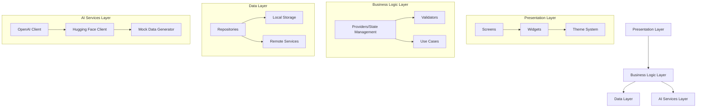
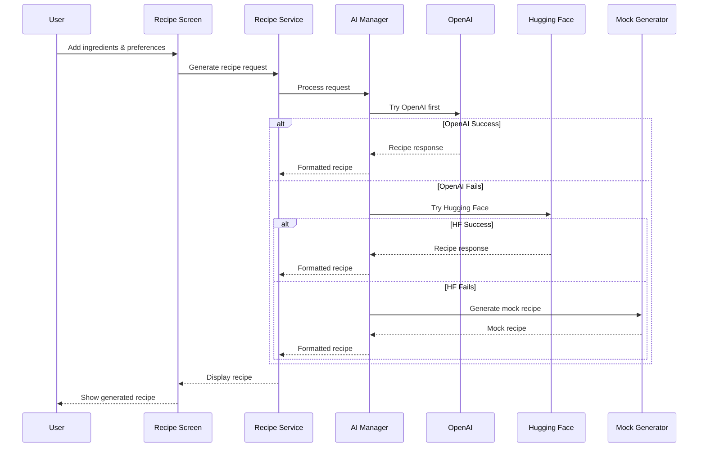
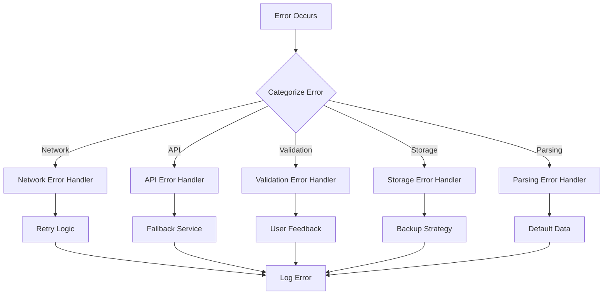

# Design Document

## Overview

This design document outlines the comprehensive solution for fixing all issues in the ChefMind AI Flutter application. The design focuses on creating a robust, user-friendly cooking assistant with reliable AI integration, proper error handling, and modern UI patterns.

## Architecture

### High-Level Architecture



### Service Integration Strategy

The app will implement a cascading AI service approach:
1. **Primary**: OpenAI GPT API with proper error handling
2. **Secondary**: Hugging Face Inference API as fallback
3. **Tertiary**: Enhanced mock data generation for offline/testing

## Components and Interfaces

### 1. AI Service Layer Redesign

#### AIServiceManager
```dart
abstract class AIServiceManager {
  Future<Recipe> generateRecipe(RecipeRequest request);
  Future<bool> isServiceAvailable();
  String get serviceName;
}

class CascadingAIService implements AIServiceManager {
  final List<AIServiceManager> services;
  
  Future<Recipe> generateRecipe(RecipeRequest request) async {
    for (final service in services) {
      try {
        if (await service.isServiceAvailable()) {
          return await service.generateRecipe(request);
        }
      } catch (e) {
        // Log and continue to next service
      }
    }
    throw AIServiceException('All AI services unavailable');
  }
}
```

#### OpenAI Service Enhancement
- Implement exponential backoff for rate limiting
- Add request/response validation
- Improve error categorization and handling
- Add request timeout and retry logic

#### Hugging Face Integration
- Create new HuggingFaceClient service
- Implement recipe generation using text-generation models
- Format responses to match OpenAI structure
- Handle model-specific prompt engineering

### 2. Recipe Generation System

#### Enhanced Recipe Generation Flow


#### Recipe Data Model Enhancement
```dart
class Recipe {
  final String id;
  final String title;
  final String description;
  final List<Ingredient> ingredients;
  final List<CookingStep> instructions;
  final RecipeMetadata metadata;
  final NutritionInfo nutrition;
  final List<String> tags;
  final DateTime createdAt;
  final String source; // 'openai', 'huggingface', 'mock'
}

class RecipeMetadata {
  final int prepTime;
  final int cookTime;
  final int servings;
  final DifficultyLevel difficulty;
  final String? cuisine;
  final MealType? mealType;
}
```

### 3. Storage and State Management

#### Enhanced Local Storage
- Implement proper Hive box management
- Add data migration strategies
- Create backup/restore functionality
- Implement data validation and cleanup

#### State Management Improvements
```dart
// Enhanced providers with proper error handling
final recipeProvider = StateNotifierProvider<RecipeNotifier, RecipeState>((ref) {
  return RecipeNotifier(ref.read(recipeRepositoryProvider));
});

class RecipeState {
  final List<Recipe> recipes;
  final bool isLoading;
  final String? error;
  final Recipe? currentRecipe;
  
  // Add proper state management methods
}
```

### 4. Navigation and Screen Architecture

#### Screen Hierarchy Redesign
```
MainApp
├── AuthWrapper
│   ├── LoginScreen
│   └── RegisterScreen
└── MainNavigation
    ├── HomeScreen
    │   ├── QuickActions
    │   └── RecentActivity
    ├── RecipeGenerationScreen
    │   ├── IngredientInput
    │   ├── PreferencesSelector
    │   └── GeneratedRecipeDisplay
    ├── RecipeBookScreen
    │   ├── RecipeList
    │   ├── SearchFilter
    │   └── RecipeDetail
    ├── ShoppingScreen
    │   ├── PantryManagement
    │   ├── ShoppingList
    │   └── BarcodeScanner
    ├── MealPlannerScreen
    │   ├── WeeklyCalendar
    │   ├── MealSlots
    │   └── NutritionSummary
    └── ProfileScreen
        ├── UserSettings
        ├── Preferences
        └── Statistics
```

### 5. UI/UX Improvements

#### Material 3 Migration
- Replace deprecated `withOpacity` with `withValues`
- Update `surfaceVariant` to `surfaceContainerHighest`
- Fix form field `value` to `initialValue`
- Implement proper color scheme usage

#### Component Standardization
```dart
// Standardized loading states
class LoadingState extends StatelessWidget {
  final String message;
  final bool showProgress;
  
  // Consistent loading UI across app
}

// Standardized error display
class ErrorDisplay extends StatelessWidget {
  final String error;
  final VoidCallback? onRetry;
  
  // Consistent error handling UI
}
```

## Data Models

### Enhanced Recipe Models
```dart
class Ingredient {
  final String name;
  final double quantity;
  final String unit;
  final String? category;
  final bool isOptional;
  final String? substitutes;
}

class CookingStep {
  final int stepNumber;
  final String instruction;
  final int? duration;
  final String? technique;
  final List<String>? requiredTools;
  final String? tips;
}

class NutritionInfo {
  final int calories;
  final double protein;
  final double carbs;
  final double fat;
  final double fiber;
  final double sugar;
  final int sodium;
  final Map<String, double>? vitamins;
}
```

### User Profile Enhancement
```dart
class UserProfile {
  final String userId;
  final String email;
  final String? displayName;
  final SkillLevel skillLevel;
  final List<DietaryRestriction> dietaryRestrictions;
  final List<String> allergies;
  final CookingPreferences preferences;
  final NutritionalGoals nutritionalGoals;
  final UserStatistics statistics;
}

class UserStatistics {
  final int recipesCooked;
  final int recipesGenerated;
  final int favoriteRecipes;
  final Map<String, int> cuisinePreferences;
  final DateTime lastActive;
}
```

## Error Handling

### Comprehensive Error Strategy

#### Error Categories
1. **Network Errors**: Connection issues, timeouts
2. **API Errors**: Rate limits, authentication, service unavailable
3. **Validation Errors**: Invalid input, missing required fields
4. **Storage Errors**: Database issues, insufficient space
5. **Parsing Errors**: Invalid response format, data corruption

#### Error Handling Flow


#### Retry Strategy
```dart
class RetryStrategy {
  static const maxRetries = 3;
  static const baseDelay = Duration(seconds: 1);
  
  static Future<T> executeWithRetry<T>(
    Future<T> Function() operation,
    {bool Function(Exception)? shouldRetry}
  ) async {
    // Exponential backoff implementation
  }
}
```

## Testing Strategy

### Unit Testing
- Test all service classes with mock dependencies
- Test state management providers
- Test data models and validation logic
- Test error handling scenarios

### Integration Testing
- Test API integration with both OpenAI and Hugging Face
- Test storage operations and data persistence
- Test navigation flows
- Test recipe generation end-to-end

### Widget Testing
- Test all custom widgets
- Test form validation
- Test loading and error states
- Test user interactions

## Performance Considerations

### Optimization Strategies
1. **Lazy Loading**: Load recipes and data on demand
2. **Caching**: Cache API responses and generated recipes
3. **Image Optimization**: Compress and cache recipe images
4. **State Management**: Minimize unnecessary rebuilds
5. **Memory Management**: Proper disposal of resources

### Monitoring and Analytics
```dart
class AnalyticsService {
  void trackRecipeGeneration(String source, Duration duration);
  void trackError(String error, String context);
  void trackUserAction(String action, Map<String, dynamic> properties);
}
```

## Security Considerations

### API Key Management
- Store API keys securely in environment variables
- Implement key rotation strategy
- Add API usage monitoring
- Implement rate limiting on client side

### Data Protection
- Encrypt sensitive user data
- Implement proper data validation
- Add input sanitization
- Secure local storage implementation

## Deployment and Configuration

### Environment Configuration
```dart
class AppConfig {
  static const String openAIApiKey = String.fromEnvironment('OPENAI_API_KEY');
  static const String huggingFaceApiKey = String.fromEnvironment('HF_API_KEY');
  static const bool enableMockData = bool.fromEnvironment('ENABLE_MOCK_DATA');
  static const String environment = String.fromEnvironment('ENVIRONMENT');
}
```

### Feature Flags
```dart
class FeatureFlags {
  static bool get enableHuggingFace => true;
  static bool get enableAdvancedNutrition => false;
  static bool get enableSocialFeatures => false;
}
```

This design provides a comprehensive solution for fixing all identified issues while maintaining code quality, user experience, and system reliability.